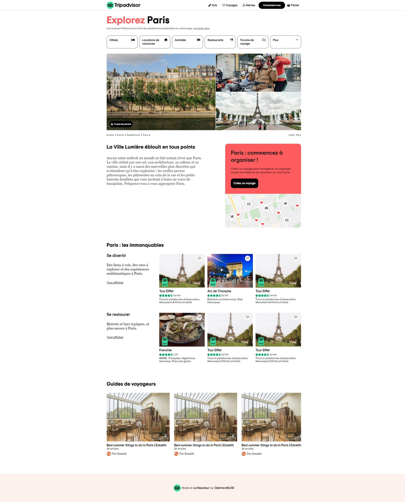

# 🎨 Replique TripAdvisor (FrontEnd)

## 📌 Description

Réalisation, au cours de ma formation au Reacteur, d'une copie du front-end du site TripAdvisor.
Objectif d'entraînement d'intégration en HTML et CSS avec une approche responsive.

## 🛠️ Technologies utilisées

- HTML
- CSS

## 📸 Captures d'écran

## 🚧 Améliorations possibles

- Ajout de javascript pour créer un modale menu et modale connecter-vous

## ✍️ Auteur

[@CedrineM](https://github.com/CedrineM)

## 📜 Licence

Ce projet est un exercice personnel réalisé dans le cadre de mon apprentissage.  
Il est uniquement destiné à des **fins éducatives** et ne doit pas être utilisé publiquement ou commercialement.
